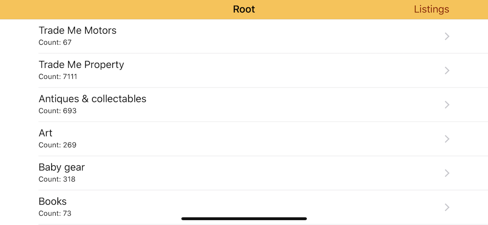
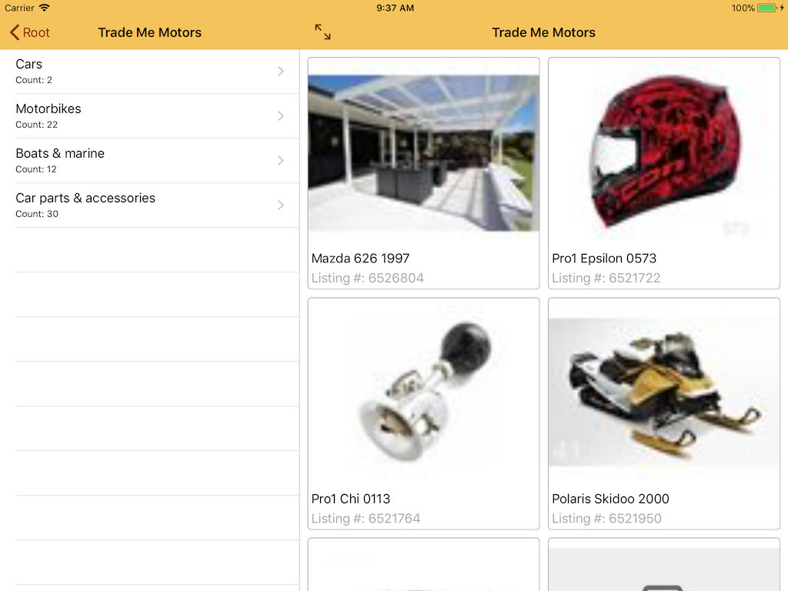

# Almost Trade Me 

Almost Trade Me is a test project that allows browsing the Trade Me categories and displays the first 20 listings in each category.

It works on iPhone and iPad in portrait and landscape modes.

When running with a compact width size class, the app will show either Category or Listings page.

Devices with the regular width class will show both views simultaneously.

The Category browser allows the user to drill through the categories and view listings at that level at the same time.
